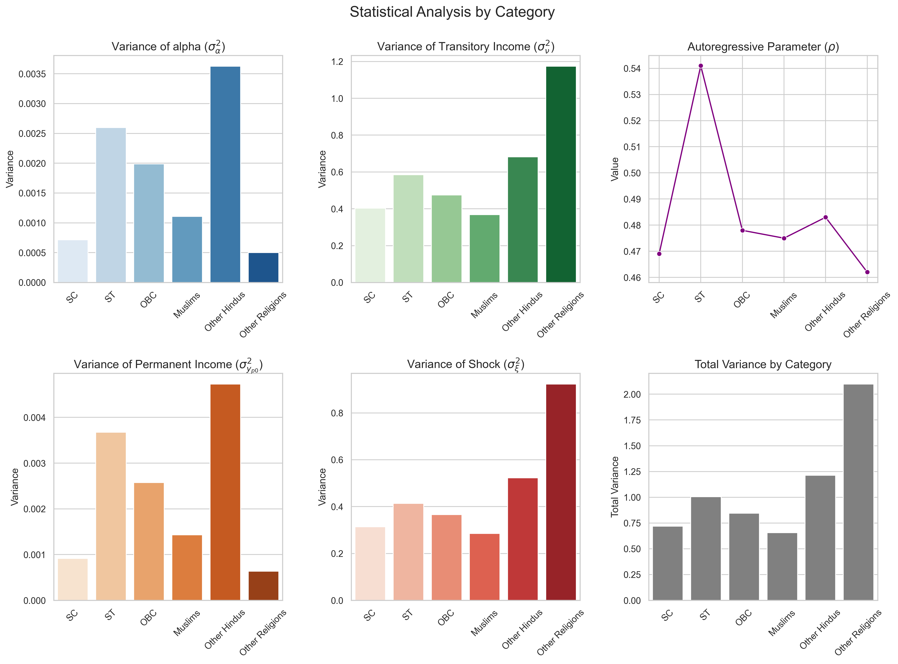

# **Income Risk Estimation Across Caste Groups in India**

This repository focuses on the estimation of income risks across heterogeneous caste groups in India, examining disparities and variations within and across these groups. The analysis aims to provide insights into how income risks differ by caste, contributing to the broader understanding of economic inequalities and their implications for policy design.  

Detailed explanations of the methodology, dataset, and results will be added soon.  

---

## **Contents of the Repository**

### 1. **Overview of the Repository**
- Detailed descriptions of all files, scripts, and results in the root directory.  
- A roadmap for navigating the repository and understanding its structure.  

### 2. **Classification of Caste Groups**
- Explanation of the classification methodology for caste groups in India.  
- Data sources and criteria used to create these classifications.  

### 3. **Income Structure, Risk Estimation and Results**
- Overview of the income structure across caste groups.  
- Methodology for estimating income risks using an AR(1) process.  
- Results obtained for each caste group 

### 4. **Appendix**
- Additional information and supplementary materials, such as intermediate results, technical notes, and potential extensions of the study.  

### 5. **References**
- Academic papers, datasets, and other resources that informed this project.  

---

## 1. **Overview of the Repository**
Here's a map about what the repository directories look like:
```
estimate_inc_risk/
│
├── 01_data/                             # Data storage (not present in the repository; download data manually)
│
├── 02_code/                             # Code for analysis
│   ├── tot_pop.ipynb                    # Jupyter notebook for total population analysis
│   ├── caste_groups.ipynb               # Jupyter notebook for caste group analysis
│   ├── graphs.ipynb                     # Jupyter notebook for generating graphs
│
├── 03_results/                          # Results and outputs
│   ├── caste_group_results.txt          # Results from caste group analysis
│   ├── population_results.txt           # Results from population analysis
│   ├── caste_results.png                # Visualization of caste group results
│
├── 04_appendix/                         # Additional notes and appendices
│   ├── appendix_notes.pdf               # Handwritten notes (typed version to be uploaded soon)
│
├── .gitignore                           # Files and directories to ignore in version control
├── LICENSE                              # License information for the project
├── README.md                            # Project overview and documentation
```
---

## 2. **Classification of Caste Groups**

The detailed wriiten code is available in `caste_groups.ipynb` in `02_code/` where I have broken down the caste groups systematically. 

### 1. SC (Social Group 1):

- Includes individuals belonging to the "SC" (Scheduled Caste) category.
- Assumes that SCs are only Hindus since there is no explicit condition to include SCs from other religions.

### ST (Social Group 2):

- Includes individuals belonging to the "ST" (Scheduled Tribe) category.
- Unlike SCs, STs are not restricted by religion. Therefore, STs from any religion (Hindu, Muslim, Christian, etc.) are included in this group.

### OBC (Social Group 3):

- Includes individuals belonging to the "OBC" (Other Backward Class) category.
- There is no restriction based on religion, meaning OBCs from all religions are included.

### Muslims (Social Group 4):

- Includes all individuals who identify as Muslim in the religion variable.
- This group encompasses Muslims from all caste categories, including SC, ST, OBC, and others.

### Other Hindus (Social Group 5):

- Includes Hindus belonging to the "Intermediate Caste" and "Upper Caste" categories.
- This group excludes SCs, STs, and OBCs among Hindus, as these categories are assigned to their respective groups (1, 2, and 3).

### Other Religions (Social Group 6):

- Includes individuals whose social group (`interest_soc_group`) is still missing `NaN` after the above classifications.
- Likely includes individuals from minority religions such as Christians, Sikhs, Jains, or those who do not fall into any of the above categories.

---

## 3. **Income Structure and Risk Estimation**

The income structure and the risk estimation strategy has been taken from the methodologies proposed by (Blundell, 2014), (Blundell et. al., 2005) & Chris Tonetti's Lecture Notes from Stanford. 

The sample is restricted to male heads of households who earn a positive net income. Furthermore, only males aged 25 to 60 are included, as they are assumed to be the primary breadwinners in Indian households. This age range reflects two key considerations: it is challenging for the average Indian man to secure stable employment before his mid-20s, and post-60s is typically considered the retirement phase of life. These restrictions ensure the sample aligns with the socio-economic realities of Indian households.

The Income Structure which I have followed for the estimation process is:
```math
y_{i,t} = \alpha_i + y_{i,t}^P + y_{i,t}^T
```
where 
- $$y_{i,t}$$ is the log form of the total income present in the dataset. 
- $$\alpha_i$$ is the individual specific component in the equation.
- $$y_{i,t}^P$$ is the permanent component of the total income.
- $$y_{i,t}^P$$ is the permanent component of the total income.

The total income has been decomposed into the permanent and transitory components, using the residuals after running the following OLS regression, inspired by Tonetti's lecture notes on income risk estimation:

```math 
y_{i,t} = \beta_0 + \beta_1 (age)_{i,t} + \epsilon_{i,t}
```
The detailed codes for decomposition are available in the `02_code` folder. 

And also, we incorporate and assume that the permanent component of income follows an autoregressive process of order 1 [AR(1) process], which can be observed by the following equation:

```math
y_{i,t}^P = \rho y_{i,t-1}^P + \xi_{i,t}
```
where $$\xi$$ is a shock parameter.

For the income risk estimation, we need to find the variances of the transitory income ($$\sigma^2_{\upsilon}$$), variances of the permanent income at time $$t = 0$$ ($$\sigma_{y_p0}^2$$), variances of the individual specific shock component ($$\sigma_{\alpha}^2$$), the variance of the shock component $$\xi$$ ($$\sigma_{\xi}^2$$) and also estimate the autoregressive parameter ($$\rho$$). 

A brief theoretical and mathematical proof is given in the `04_appendix` folder. I'll be uploading a detailed proof soon. 

Once they have been estimated across social groups in India, the estimation results can be found in the `03_results` folder. The file  `population_results.txt` consists of the parameter estimation results for the entire population. Whereas parameter estimations for each caste group is given in the `caste_group_results.txt ` file, along with the confidence intervals. 

## Results

<!-- To fit the image to the page width -->


---

## References

Blundell, Richard, Hamish Low, and Ian Preston. "Income risk and consumption inequality: a simulation study. 2004a." Ref Type: Report.

Blundell, Richard. "Income dynamics and life‐cycle inequality: mechanisms and controversies." The Economic Journal 124, no. 576 (2014): 28
