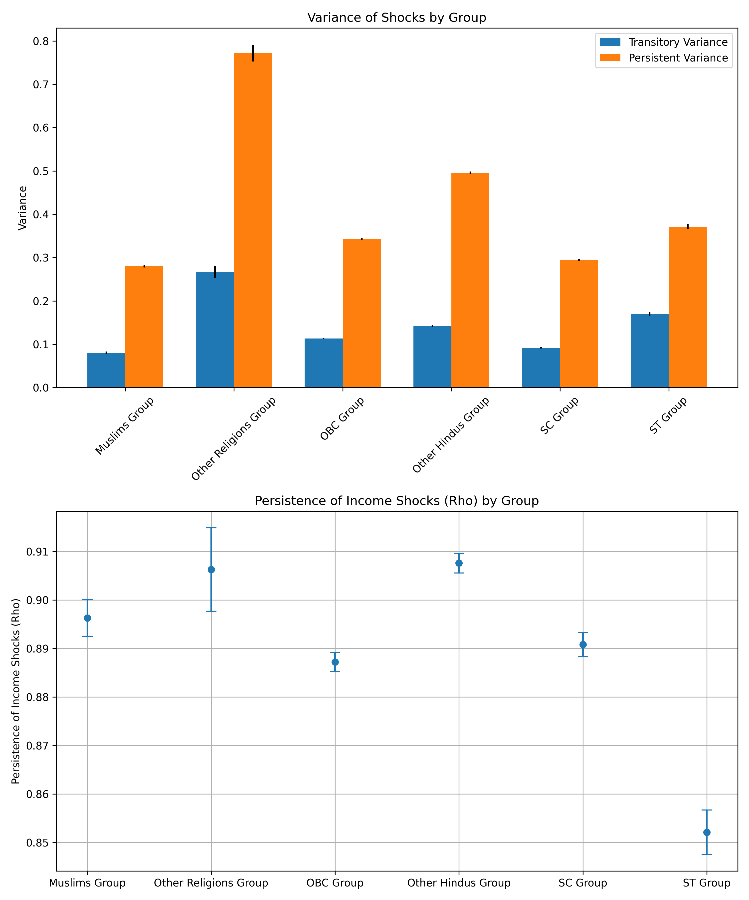

# Income risk estimation across caste groups in India

I will be adding the repo explanation as well as the methodology very soon. Till then, please proceed to check out the estimating process codes in the ```02_code``` folder. The file ```estimation_code.ipynb``` consists of the income risk estimation process for the entire population. The file ```estimate_caste_groups``` consists of the codes for each caste group (It also consists of the methodology of how I have segregated each caste group). Precisely, it only considers the Male head of households, who are often considered as the bread-winners in India, within the earning age group i.e. 25 to 60 years of age. 

Underneath is a snap of the results that i have received. Explanation will be provided soon.


